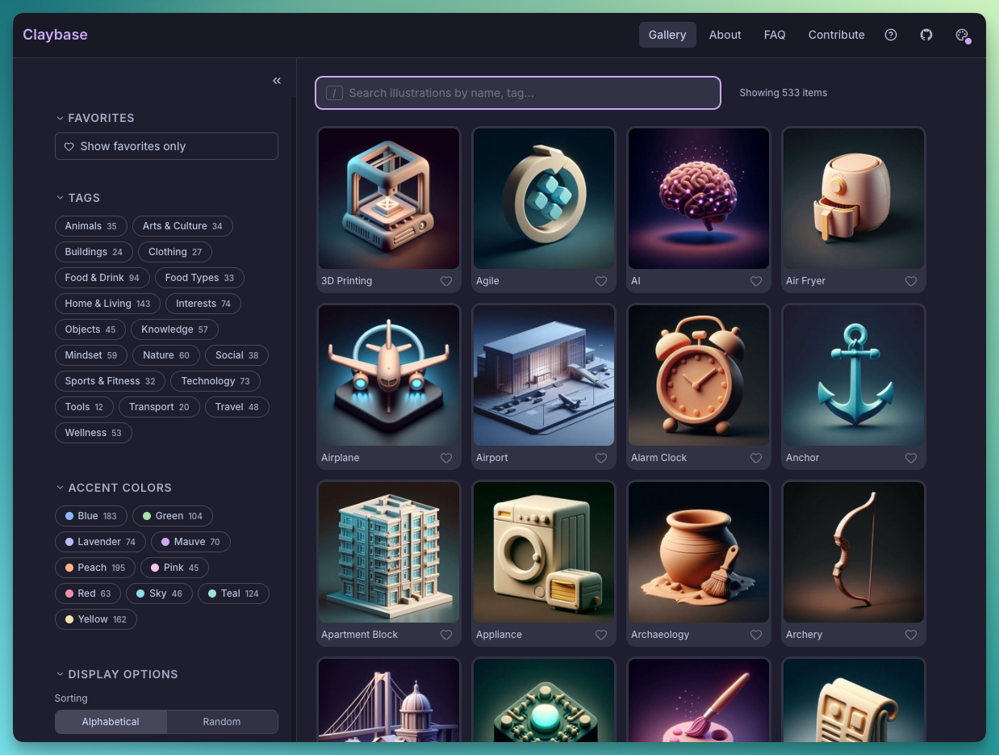

# Claybase

A curated library of AI-generated 3D clay render illustrations.

[](https://github.com/feustpat/claybase/actions/workflows/ci.yml)

**Live site:** https://claybase.vercel.app

> **Work in progress.** This project is under active development and may change significantly over time.

A personal library of AI-generated illustrations in a consistent 3D clay render style, built on the [Catppuccin Mocha](https://catppuccin.com) color palette. Originally created for use in [Obsidian](https://obsidian.md), but works well anywhere you need clean, coherent visuals.

[](https://claybase.vercel.app)

## Features

- Browse and search a growing illustration library
- Filter by tags and accent colors
- Favorites saved locally in the browser
- Download any illustration, or batch-download favorites as a ZIP
- Light and dark theme with accent color picker
- Keyboard-navigable
- Responsive, mobile-friendly layout

## Tech stack

- [React 18](https://react.dev) + [TypeScript](https://www.typescriptlang.org)
- [Vite 5](https://vitejs.dev)
- [Tailwind CSS](https://tailwindcss.com) with Catppuccin Mocha tokens
- [React Router v6](https://reactrouter.com)
- [Fuse.js](https://www.fusejs.io) for fuzzy search
- [Sharp](https://sharp.pixelplumbing.com) for image processing at build time

## Getting started

```bash
npm install
npm run dev
```

The dev server runs `build:data` first, which processes `assets/` and `meta/` into `public/`. You need both folders populated for the app to show any illustrations.

## Adding illustrations

Each illustration needs two files:

**`assets/Slug-Name.jpeg`**: the source image (any resolution, square recommended)

**`meta/Slug-Name.md`**: frontmatter with metadata:

```yaml
---
creation-date: 2026-01-01
illustration-model: DALL-E 3
illustration-style: 3D clay render
illustration-color-scheme: Catppuccin Mocha
illustration-accent-colors:
  - Catppuccin-Mauve
illustration-tags:
  - tech
illustration-aliases:
  - Brain
illustration-prompt: "optional prompt text"
---
```

Then run `npm run build:data` (or restart `npm run dev`) to regenerate the index and image variants.

## Content

### Help panel and FAQ

The help panel and FAQ page are plain markdown files, no code changes needed to update them:

| File | Content |
|---|---|
| `src/content/gallery-help.md` | Help panel |
| `src/content/faq.md` | FAQ page |

### UI strings

All UI text lives in `src/locales/en.ts`.

### Tag display names

Raw tag IDs (e.g. `food-drink`) are stable identifiers used in URLs and filter logic. Human-readable display names are defined separately in `src/locales/tag-names.ts`. Tags without an entry fall back to their raw ID.

## Build

```bash
npm run build
```

Outputs to `dist/`. The build step processes all illustrations into three sizes: thumbnails (200px), display (512px), and downloads (512px).

## Deployment

The site is deployed on [Vercel](https://vercel.com) with automatic deploys on every push to `main`. No configuration file is needed; Vercel detects Vite automatically.

One non-obvious requirement: `public/illustrations/` and `public/data/` are excluded from git (they are generated output). Vercel must run `npm run build` as the build command, which runs `build:data` first and generates those folders from the committed `assets/` and `meta/` source files.

## Scripts

| Command | Description |
|---|---|
| `npm run dev` | Start dev server (rebuilds data first) |
| `npm run build` | Production build |
| `npm run build:data` | Process illustrations and regenerate index |
| `npm run validate` | Validate illustration metadata |
| `npm run lint` | ESLint |
| `npm run format` | Prettier |
| `npm run test` | Vitest |
| `npm run test -- --coverage` | Vitest with coverage report |

## Design decisions

Short architecture decision records live in [`docs/adr/`](docs/adr/) — why prompts
are published, why the build is local-first, and why the URL is the source of truth
for gallery state.

## Contributing

Found a bug or have an idea for a new illustration? See [CONTRIBUTING.md](CONTRIBUTING.md).

## License

- **Code**: [MIT](LICENSE)
- **Illustrations** (`assets/`): [CC BY-NC 4.0](assets/LICENSE). Free for personal use with attribution; commercial use is not permitted.
